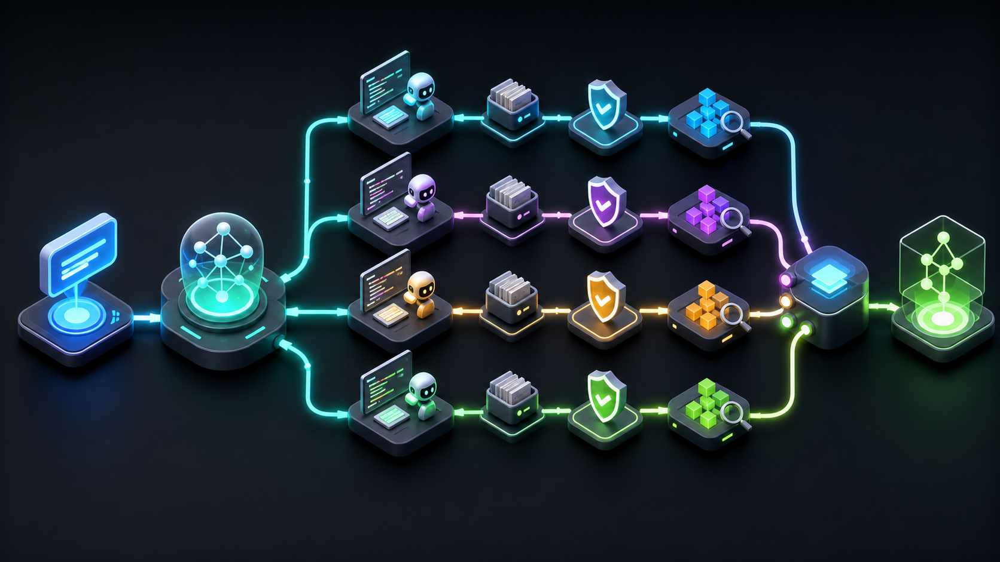

# Genesis

```
   ____                          _
  / ___| ___ _ __   ___  ___  __(_)___
 | |  _ / _ \ '_ \ / _ \/ __|/ _` / __|
 | |_| |  __/ | | |  __/\__ \ (_| \__ \
  \____|\___|_| |_|\___||___/\__,_|___/

        local AI orchestration for software work.
```

Genesis is a terminal-only AI orchestration system for Windows. It coordinates Claude Code as the planner and reviewer, plus Codex CLI workers as autonomous code executors, so a single prompt can be broken into scoped, reviewed, verified, and committed development steps.

No API keys are required. Genesis uses your existing Claude Code Pro and ChatGPT Pro sessions through their official CLI tools.


<p align="center">
  
</p>

## Why Genesis

Most AI coding tools work as one assistant in one working tree. Genesis is built around a small local team model:

- Claude Code plans the task and reviews completed work.
- Codex workers execute implementation steps in isolated git worktrees.
- Verification commands run before approved changes reach the main repository.
- Durable state is stored locally so runs can be inspected, resumed, or retried.
- Git commits are created only after review and verification pass.

The result is a local command center for multi-step software work, with a visible audit trail and conservative repository handling.

## How It Works

When you type `run <task>`, Genesis:

1. Sends the task to the orchestrator, which returns a structured JSON execution plan.
2. Assigns ready steps to worker agents based on dependencies and file scope.
3. Runs each worker inside an isolated git worktree.
4. Captures the patch and sends it to an independent reviewer role.
5. Runs configured verification commands in isolation.
6. Applies approved patches to the main repository and commits them.
7. Records progress in local memory and SQLite runtime state.

During execution you see a live command-center dashboard with plan state, active workers, reviewer handoffs, streaming output, verification status, git activity, recent events, and usage metrics.

<p align="center">
  
</p>

## Features

- Local terminal workflow with no hosted control plane.
- Claude Code and Codex CLI integration through existing OAuth sessions.
- Multi-account Codex worker support for parallel execution.
- Isolated git worktrees for worker changes.
- Bounded self-repair when review or verification fails.
- Durable runs with `resume`, `retry`, `inspect`, and `cleanup`.
- Configurable verification gates before commit.
- Memory file plus searchable SQLite runtime memory.
- Account management from inside the Genesis REPL.

## Requirements

- Windows
- Python 3.10 or later
- Git
- Claude Code CLI installed and logged in
- Codex CLI installed and logged in
- Node.js 18 or later if installing Codex through npm

## Quick Start

Clone and install Genesis:

```powershell
git clone https://github.com/AmRitJain0442/Genesis.git
cd Genesis
pip install -e .
```

Install and authenticate the required agent CLIs:

```powershell
claude login
codex login
```

Create the Genesis config:

```powershell
genesis init
```

Start Genesis inside any git repository:

```powershell
cd C:\Projects\my-app
genesis
```

Run a task:

```text
genesis> run build a REST API with user auth, a PostgreSQL backend, and pytest tests
```

## Setup Guide

### 1. Install Python

Download Python 3.10 or later from:

```text
https://python.org/downloads
```

During installation, enable `Add Python to PATH`.

Verify the installation:

```powershell
python --version
```

### 2. Install Claude Code CLI

Download Claude Code from:

```text
https://claude.ai/download
```

Log in:

```powershell
claude login
```

Verify it works:

```powershell
claude --version
```

### 3. Install Codex CLI

Install Codex through npm:

```powershell
npm install -g @openai/codex
```

Log in:

```powershell
codex login
```

Verify it works:

```powershell
codex --version
```

### 4. Configure Genesis

Create the config file:

```powershell
genesis init
```

This creates:

```text
~/.genesis/config.toml
```

Recommended orchestrator settings:

```toml
[orchestrator]
provider = "claude-cli"
model = "claude-sonnet-4-6"
```

Recommended worker settings:

```toml
[worker]
provider = "codex-cli"
model = "auto"
```

Check the system:

```powershell
genesis status
```

Expected agent roster:

```text
Agents:   Claude Code . Codex
Active:   claude-cli-orchestrator, claude-cli-worker, codex-main
```

If either CLI is missing, run `claude login` or `codex login` again in the same terminal.

## Commands

| Command | Description |
| --- | --- |
| `run <task>` | Execute a task through the AI orchestrator. |
| `plan <task>` | Generate and preview a plan without executing it. |
| `resume <run_id>` | Resume a durable run from stored state. |
| `retry <run_id> <step_id>` | Retry a blocked step, then continue the run. |
| `runs` | Show recent durable runs. |
| `inspect <run_id>` | Show run state and event trace. |
| `cleanup <run_id>` | Remove stale isolated worktrees for a run. |
| `status` | Show agents, config, and recent git log. |
| `agents` | List registered agents and their status. |
| `config show` | Print the active configuration. |
| `config edit` | Open the config file in your editor. |
| `git log` | Show recent Genesis commits. |
| `git commit [message]` | Manually commit current changes. |
| `memory show` | Print the shared memory file. |
| `memory search <query>` | Search SQLite memory. |
| `memory mine` | Import `GENESIS_MEMORY.md` into SQLite memory. |
| `memory clear` | Reset memory for a new project. |
| `memory append <text>` | Add a manual note to memory. |
| `switch orchestrator <name>` | Hot-swap the orchestrator agent. |
| `switch worker <name>` | Hot-swap the default worker agent. |
| `add-account` | Add a Codex account interactively. |
| `remove-account <name>` | Remove one Codex account from Genesis. |
| `remove-all-accounts` | Remove every Codex account from Genesis. |
| `help` | Show all commands. |
| `exit` | Quit Genesis. |

## Codex Account Management

Genesis can register multiple Codex accounts as separate workers. Each account uses a separate `CODEX_HOME` directory and its own login session.

Add an account:

```text
genesis> add-account
```

Remove one account:

```text
genesis> remove-account codex-2
```

Remove all registered Codex accounts:

```text
genesis> remove-all-accounts
```

Remove accounts and delete non-default `CODEX_HOME` folders:

```text
genesis> remove-all-accounts --delete-home
```

Genesis never deletes the default `~/.codex` directory through `--delete-home`. Use `codex logout` if you want to clear the global Codex login.

## Command-Center UI

The live dashboard is designed for repeated software work rather than a one-off chat session.

| Area | What It Shows |
| --- | --- |
| Header | Task, phase, elapsed time, current step, active worker, active reviewer, latest commit, and progress. |
| Execution Plan | Step status, effective scope, repair count, title, and completion state. |
| Agent Output | Streaming worker commands, file changes, review results, repair attempts, verification output, commits, and errors. |
| Team | Configured agents with role and active state. |
| Quality Gates | Review and verification status per step. |
| Event Trace | Recent leases, reviews, repairs, verification, commits, and release summaries. |
| Telemetry | Input tokens, output tokens, cached tokens, cost, and per-agent usage. |

Static REPL views use the same command-center styling. `status` shows the agent roster and runtime controls, `runs` lists recent runs, `inspect <run_id>` opens the diagnostic view, and `plan <task>` previews dependencies and file scopes before execution.

## Memory

Genesis writes a `GENESIS_MEMORY.md` file to the root of your repository. This records task plans, step outcomes, review verdicts, and completion timestamps.

The memory file is injected into planning and review prompts so the orchestrator understands what already exists before it proposes new work.

Genesis also keeps a local SQLite state database:

```text
~/.genesis/state/genesis.db
```

SQLite stores durable run events, checkpoints, verification results, patch artifacts, and searchable memory entries. Markdown memory remains the human-readable project log.

Search memory:

```text
genesis> memory search authentication middleware
```

Import an existing memory file:

```text
genesis> memory mine
```

Clear memory for a conceptually new project:

```text
genesis> memory clear
```

## Git Integration

With `auto_commit = true`, Genesis commits only after review and verification pass:

```text
[genesis] step-2: Implement authentication middleware
[genesis] task-complete: Build REST API with auth and tests
```

Enable auto-push in `~/.genesis/config.toml`:

```toml
[git]
auto_push = true
remote = "origin"
branch = "main"
```

Genesis runs workers in isolated git worktrees under:

```text
~/.genesis/worktrees/
```

A worker patch is captured, stored in SQLite, reviewed, verified in isolation, checked with `git apply --check`, then applied to the main repository and committed. Failed or rejected steps leave the main repository unchanged and can be inspected or retried.

Parallel execution is available when `runtime.max_parallel_workers` is greater than 1 and multiple workers are configured. Genesis leases non-overlapping file scopes to workers and still applies accepted patches one at a time to the main repository.

## Configuration Reference

Full `~/.genesis/config.toml` example:

```toml
[orchestrator]
provider = "claude-cli"
model = "claude-sonnet-4-6"

[worker]
provider = "codex-cli"
model = "auto"

[claude_cli]
command = "claude"
timeout = 300

[codex_cli]
command = "codex"
timeout = 600

[[codex_cli.accounts]]
name = "codex-main"
home = ""
model = "auto"

[git]
auto_commit = true
auto_push = false
remote = "origin"
branch = "main"
commit_prefix = "[genesis]"

[memory]
file = "GENESIS_MEMORY.md"
max_context_chars = 6000
auto_append_plan = true
palace_enabled = true

[runtime]
state_db = ""
retry_budget = 1
max_parallel_workers = 1
checkpoint_mode = "always"

[verification]
commands = []
timeout = 300
require_for_commit = true

[policy]
file = "genesis.policy.toml"
protected_paths = [".git/", ".genesis/state/"]
blocked_commands = ["git reset --hard", "git checkout --", "Remove-Item -Recurse -Force", "rm -rf /"]
allowed_commands = []
```

## Architecture

```text
genesis/
  agents/
    orchestrator.py    Planning, review, scheduling, and run control
    claude_cli.py      Claude Code subprocess adapter
    codex_cli.py       Codex CLI subprocess adapter
    worker.py          Claude worker implementation
    codex_worker.py    Codex worker implementation
  schemas/
    plan.py            Plan and Step models
    review.py          Review model
  ui/
    dashboard.py       Live dashboard state and layout
    console.py         Shared Rich Console singleton
  config.py            TOML config loader and dataclasses
  palace.py            SQLite memory store with FTS search
  runtime.py           Durable run events and artifacts
  scheduler.py         Dependency and file-scope worker leasing
  worktree.py          Isolated git worktrees and patch application
  policy.py            Protected path and command policy checks
  verifier.py          Configurable verification gates
  memory.py            GENESIS_MEMORY.md reader and writer
  git_ops.py           GitPython wrapper
  repl.py              REPL loop and command dispatch
  main.py              CLI entry point
```

## Development

Install in editable mode:

```powershell
pip install -e .
```

Run tests:

```powershell
python -m pytest -q
```

Run the REPL from the repository:

```powershell
python -m genesis.main
```

## Troubleshooting

### Claude says you have hit your limit

Claude Pro rate limit reached. Wait for the reset time shown in the message. To reduce how often this happens, use `claude-sonnet-4-6` instead of `claude-opus-4-6` for the orchestrator.

### Codex exits with code 1

The Codex account is not logged in, or the session expired. Run:

```powershell
codex login
```

For a secondary account:

```powershell
set CODEX_HOME=C:/Users/yourname/.codex-2
codex login
```

### No worker agents are available

Open a new terminal, then confirm both CLIs are visible:

```powershell
claude --version
codex --version
```

Run `genesis status` from the same terminal.

### TOML parse error after editing config.toml

Use forward slashes in Windows paths inside TOML strings.

Correct:

```toml
home = "C:/Users/yourname/.codex-2"
```

Incorrect:

```toml
home = "C:\Users\yourname\.codex-2"
```

### Dashboard shows boxes or garbled characters

Set UTF-8 mode before running Genesis:

```powershell
set PYTHONUTF8=1
genesis
```

To make this permanent, add `PYTHONUTF8=1` to your user environment variables in Windows.

## Contributing

Issues and pull requests are welcome. Good contributions for this project include:

- Better CLI adapters and status checks.
- Safer verification defaults.
- More tests around worktree and patch behavior.
- Documentation improvements.
- UI refinements that keep the terminal workflow fast and readable.

Please run the test suite before opening a pull request:

```powershell
python -m pytest -q
```
